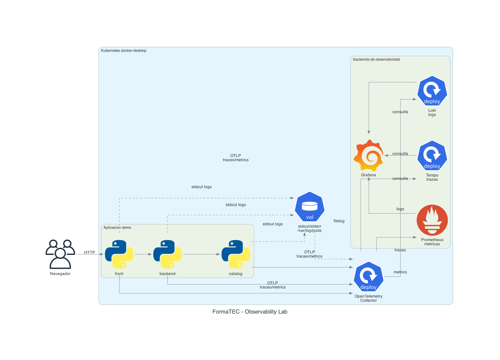

# Modulo 3 - Clase 5: Observabilidad con OpenTelemetry

Lab para ver metricas, logs y trazas en Kubernetes local.

Stack:

- App demo: `front -> backend -> catalog`
- OpenTelemetry Collector
- Prometheus
- Tempo
- Loki
- Grafana

Flujo de observabilidad:

```text
trazas y metricas -> OTLP -> Collector -> Tempo / Prometheus
logs              -> stdout/stderr -> Kubernetes -> Collector -> Loki
visualizacion     -> Grafana
```

## Diagrama



El diagrama se genera desde `docs/diagrams/observability_lab.py` con Mingrammer Diagrams.

## 1. Requisitos

Docker Desktop con Kubernetes habilitado.

Verificar:

```text
kubectl config use-context docker-desktop
kubectl get nodes
```

El nodo debe estar `Ready`.

## 2. Levantar el lab

Clonar:

```text
git clone https://github.com/formatec-c4/m3-clase5.git
cd m3-clase5
```

Aplicar manifests:

```text
kubectl apply -f manifests/00-namespace.yaml
kubectl apply -f manifests/10-observability-config.yaml
kubectl apply -f manifests/11-observability-stack.yaml
kubectl apply -f manifests/20-demo-apps.yaml
```

Verificar:

```text
kubectl -n observability-lab get pods
```

Esperar a que todo quede `Running`.

No se construyen imagenes. Kubernetes descarga estas imagenes publicas desde Docker Hub:

```text
docker.io/formatecc4/otel-front:v4
docker.io/formatecc4/otel-backend:v4
docker.io/formatecc4/otel-catalog:v4
```

## 3. Abrir la app

Terminal 1:

```text
kubectl -n observability-lab port-forward svc/front 8080:8000
```

Abrir:

```text
http://localhost:8080
```

Hacer varios clicks en `Generar request`.

El `catalog` falla aleatoriamente en algunas requests para que se vean errores en logs, metricas y trazas.

Tambien se puede generar trafico por terminal:

```text
curl http://localhost:8080/api/demo
```

## 4. Ver logs crudos en Kubernetes

Antes de mirar Grafana, ver que la app loguea por stdout/stderr:

```text
kubectl -n observability-lab logs deploy/front
kubectl -n observability-lab logs deploy/backend
kubectl -n observability-lab logs deploy/catalog
```

Buscar lineas con:

```text
trace_id=
ERROR
catalog_price_failed
```

Idea clave: la app no manda logs directo a Loki. Escribe logs como cualquier contenedor.

## 5. Ver Prometheus directo

Terminal 2:

```text
kubectl -n observability-lab port-forward svc/prometheus 9090:9090
```

Abrir:

```text
http://localhost:9090
```

Consultas:

```text
formatec_demo_http_requests_total
```

```text
sum by (service_name, http_status_code) (formatec_demo_http_requests_total)
```

Que observar:

- aparecen `front`, `backend` y `catalog`;
- las requests con error aparecen con codigos 5xx.

## 6. Donde se guarda cada cosa

En este lab no hace falta entrar directo a Loki ni a Tempo.

- Prometheus guarda metricas.
- Loki guarda logs.
- Tempo guarda trazas.
- Grafana consulta esas tres fuentes y muestra todo en una sola vista.

## 7. Ver todo en Grafana

Terminal 3:

```text
kubectl -n observability-lab port-forward svc/grafana 3000:3000
```

Abrir:

```text
http://localhost:3000
```

Entrar al dashboard:

```text
Dashboards -> FormaTEC -> FormaTEC - Observabilidad end to end
```

El dashboard incluye:

- requests totales;
- errores 5xx;
- servicios activos;
- requests por minuto;
- errores por minuto;
- logs filtrables por servicio;
- logs filtrables por `trace_id`;
- logs de error.

Uso recomendado:

1. Generar trafico hasta que aparezca un error.
2. Ir al panel `Logs de error`.
3. Copiar un `trace_id`.
4. Pegar el valor en la variable `Trace ID o regex`.
5. Revisar todos los logs de esa request.
6. Usar el link `TraceID` si se quiere ver el recorrido completo de esa request.

## 8. Limpiar

```text
kubectl delete namespace observability-lab
```

## Resumen

Lo importante del lab:

- metricas: Prometheus muestra volumen y errores;
- logs: las apps escriben stdout/stderr y Loki los guarda;
- trazas: Tempo guarda el recorrido completo;
- correlacion: `trace_id` une logs y trazas;
- Grafana junta todo para investigar una request.
